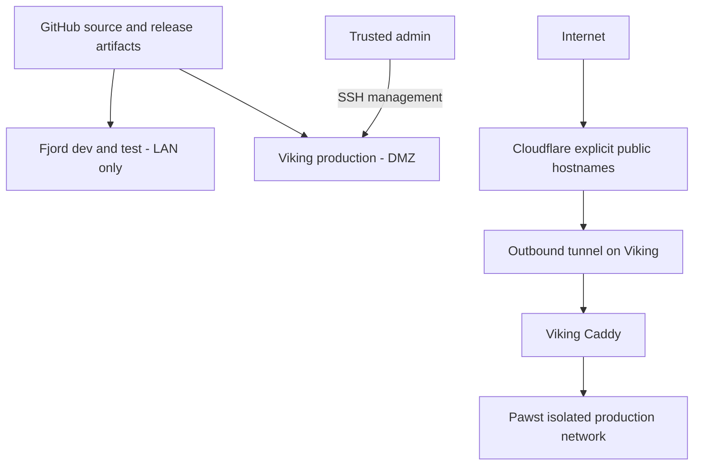

# Application platforms: Fjord and Viking

**Deployment status (2026-09-20):** Viking serves both public Pawst sites;
Fjord dev/test configuration is implemented but not yet verified live.
Viking is a replaceable production/DMZ role. The existing Pi 3 B+ can serve
these small static sites; benchmark future workloads before scheduling them.
The [live hardening record](viking-hardening.md) documents the operator-tested Nest guest-network/Tailscale implementation and its limits. Space-needle remains the trusted infrastructure/DNS host. No Fjord-to-Viking SSH,
file copying, shared NAS mounts or runtime dependency is part of this design.
The implementation plan is in [the issue body](../../plans/fjord-viking-platform.md).



## Compose and hostname conventions

Use `services/<application>/docker-compose.yml` with
`hosts/<role>/overrides/<application>/docker-compose.override.yml`; `loft-ctl`
resolves both. Require Compose **2.24.4 or later** for `!override`. The Mushr
host overrides replace the complete service map: they do not inherit
space-needle's broad route table, DNS server, host gateway, plugin build, secret
environment or briefing mounts. Space-needle retains its trusted infrastructure
routes; Pawst's old Caddy and public-site DNS overrides have been removed.

Fjord's first concrete example is Pawst: independent `pawst-dev` and `pawst-test`
containers, document roots and internal Docker networks. Hostnames are
`<application>.<dev|test>.fjord`; Pawst uses `pawst.dev.fjord`, `pawst.test.fjord`,
`hsimah.dev.fjord` and `hsimah.test.fjord`. Existing Mushr DNS already resolves
`*.fjord` to `192.168.86.30`; it requires no public DNS change. Fjord Caddy binds
that LAN address, configurable as `FJORD_BIND_IP` in `services/mushr/.env`.
These example routes are HTTP on a trusted development LAN: do not use real
production credentials/data there. Applications needing secure cookies/OAuth
must add internal TLS with a trusted development CA and LAN-only DNS names.
Never add Fjord names to a tunnel, public origin, wildcard ingress or router
forwarding rule. A LAN address alone does not enforce a trust boundary: restrict
Fjord's host/forward firewall to trusted clients too.

Viking exposes only Caddy's `127.0.0.1:8080` for local verification or SSH port
forwarding. Cloudflared reaches `http://mushr:8080` on its own ingress network;
Pawst uses a separate `internal: true` network. There is no host-published app,
admin API or tunnel metrics port. Only explicit Host matches reach applications;
unknown hosts receive 404. Cloudflare terminates public TLS and the tunnel
protects transit to the connector; the final HTTP hop stays on Viking's Docker
bridge. Enable Cloudflare's HTTPS redirect at the edge. Caddy has no DNS API
credential and no ACME dependency in these roles.

Mushr owns the named application networks and must start before applications.
Use `loft-ctl start mushr pawst`. Stop applications before Mushr; a proxy rebuild
may report that a network is still in use, so prefer Compose `up -d` for proxy
changes. Separate networks block direct cross-app traffic, but Caddy is a shared
trust boundary: an app can reach Caddy on its own network, including other
explicit proxy routes. Sensitive interfaces still need application authentication.
Docker internal networks are defense in depth, **not the DMZ firewall**.

## Required network boundary (operator gate)

Complete and record these values before provisioning production:

| Network object | Required value |
|---|---|
| DMZ | Dedicated VLAN ID, IPv4 CIDR, optional IPv6 prefix, gateway, reserved Viking address |
| TRUSTED | Every trusted LAN/VLAN, VPN, storage, infrastructure and management IPv4/IPv6 prefix |
| ADMIN | Explicit management device IPs/subnets (smaller than all TRUSTED) |
| DNS | Approved resolver IPs, UDP and TCP 53 only |
| NTP | Approved time server IPs, UDP 123 only |
| UPDATE | Approved public package, GitHub API/release/CDN and registry destinations |
| CF_TUNNEL | Current Cloudflare tunnel destination IPs, TCP and UDP 7844 |

Do not invent a DMZ address based on Viking's old `192.168.86.26` reservation.
For the full router-enforced policy below, use equipment that can isolate VLANs
and filter inter-VLAN traffic. The current Nest guest network with host filtering
and Tailscale is a documented alternative with narrower verified guarantees
(see the live hardening record); it does not implement these router rules. A second address on the same flat LAN is not
a DMZ. Put the switch port/SSID in the DMZ, remove trusted Wi-Fi credentials,
disable unused interfaces and ensure Viking has no second trusted connection.
Apply anti-spoofing on the DMZ interface and equivalent IPv6 policy, or disable
IPv6 on the DMZ/host until it can be filtered. Include globally routed home IPv6
prefixes and VPN routes in TRUSTED, not only RFC1918/ULA ranges.

Apply the following ordered stateful router rules to **host and Docker-forwarded
traffic**, before generic LAN/Internet allows. `NEW` means initiated connections;
reply traffic for permitted connections is allowed:

| Order | Source → destination | Action |
|---|---|---|
| 1 | Invalid state / spoofed DMZ sources | Drop |
| 2 | Established/related permitted flows | Allow replies |
| 3 | ADMIN → Viking TCP 22 | Allow SSH; no WAN SSH |
| 4 | Viking → DNS UDP/TCP 53; Viking → NTP UDP 123 | Allow exact resolver/server IPs only |
| 5 | Viking → TRUSTED, gateway/router management, other DMZ clients | Deny all new traffic and log with rate limit |
| 6 | Viking → CF_TUNNEL TCP/UDP 7844 | Allow tunnel |
| 7 | Viking → UPDATE TCP 443 | Allow release/registry/package retrieval |
| 8 | Any other new ingress/egress to/from Viking | Deny and rate-limit log |

Rule 5 must precede Internet/update permissions. Use HTTPS package sources;
if an actual mirror requires TCP 80, document a destination-specific exception,
not a general LAN or port-80 allow. For registries/CDNs with changing destinations,
an explicit public-only TCP 443 policy may be a practical documented exception
(after denying TRUSTED, link-local, private, management and other DMZ ranges).
Allow necessary ICMP/ICMPv6 control traffic (PMTU, neighbor discovery on the DMZ)
without granting application access. DHCP, if used, needs only its exact gateway
UDP 67/68 (IPv6 546/547) exchange. No mDNS/SSDP discovery across the boundary.
No monitoring egress exception is required by this configuration.

On Viking also install a persistent host firewall: INPUT default drop, loopback
and established/related allow, ADMIN TCP 22 allow; OUTPUT default drop with the
same destination exceptions above. Apply the egress rules to container FORWARD
traffic as well, without blocking required Caddy↔app and tunnel↔Caddy bridge
flows. Deny new bridge-to-host traffic; allow replies to host-initiated probes.
For Docker's iptables backend, filter before Docker accept rules using
`DOCKER-USER`; for its nftables backend, use an appropriate independent forward
base chain. Do not flush Docker-managed rules. A host INPUT-only/UFW rule does
not reliably filter Docker-published ports. Persist rules across Docker and host
restarts, inspect counters and test both after reboot. See
[Docker firewall behavior](https://docs.docker.com/engine/network/packet-filtering-firewalls/)
and [Cloudflare tunnel destinations](https://developers.cloudflare.com/cloudflare-one/networks/connectors/cloudflare-tunnel/configure-tunnels/tunnel-with-firewall/).
Router-specific commands require the actual router model, addresses and firewall
backend; this repo deliberately does not execute guessed rules.

Test **before public exposure**, from the host AND from each application and
proxy network namespace (a temporary diagnostic container must have no extra
network, privilege or host networking). Try real known-open services on
space-needle (`192.168.86.28`), Fjord (`192.168.86.30`), NAS/storage and router UI,
both by IPv4 and IPv6. They must fail except exact approved DNS/NTP destinations.
Check firewall drop counters to distinguish enforcement from a dead destination.
A DNS exception must not permit that resolver's HTTP/SSH ports. Verify successful
ADMIN SSH, public artifact fetch and tunnel connectivity; verify non-admin SSH
fails. Confirm no router 80/443 port forwarding, UPnP mapping, Cloudflare private
network route or other connector bypasses this policy. Record results and reboot
verification. Then attest locally:

```bash
sudo install -d -m 755 /etc/loft
sudo touch /etc/loft/dmz-ready
```

`setup.sh` and mutating `loft-ctl` operations check this marker for Viking. It is
an operator attestation, not a firewall or a protection against direct Docker
commands. Remove it when the role moves network/hardware until revalidated.

## Host preparation, credentials and monitoring

Finish [Woodstock's audio cutover](../hosts/woodstock.md#upstairs-cutover) first.
Before applying Viking's new manifest, explicitly retire Howlr with the old
checkout (`loft-ctl stop howlr`) or stop its container and disable restart;
removing a service from a manifest does not stop existing containers. Preserve
Snoot and Glances for the user's required monitoring. Disable obsolete audio services,
discovery, cron and listeners and verify `sudo docker ps` and `sudo ss -lntup`.
Viking retains Snoot and Glances as trusted host-monitoring exceptions, with
only space-needle permitted to reach their ports over Tailscale. They retain
host visibility and Docker socket access; a read-only socket mount does not
restrict Docker API operations. They must never share these privileges with
public applications. Viking's Houstn override excludes all hub services.
See the live hardening record for the tested access policy and Homepage mapping.
Fjord can retain its existing trusted-LAN metrics configuration.

Provision a supported minimal 64-bit Debian system, Docker Engine and Compose.
Before disabling passwords, install and test adminhabl's authorized key in a
second session with local console recovery available. Set effective sshd policy
`AllowUsers adminhabl`, `PermitRootLogin no`, `PubkeyAuthentication yes`,
`PasswordAuthentication no`, `KbdInteractiveAuthentication no`, and
`AuthenticationMethods publickey`. Check `sudo sshd -t` and `sudo sshd -T`
(including Match blocks) before reloading SSH. Setup's existing password setting
alone does not verify distribution drop-in precedence. Never publish SSH through
Cloudflare or WAN. Treat Docker/admin group membership as root-equivalent;
production setup removes littledog's Docker membership and keeps adminhabl's.
Recheck memberships after provisioning and remove unused legacy audio groups.

Install/configure `unattended-upgrades` for the distribution's security origin;
verify `sudo unattended-upgrade --dry-run --debug` and enabled apt timers.
Schedule reboots and check disk/SD-card health. Keep compilers, desktop/audio
services and app source builds off production. The bootstrap remains the shared
fleet setup; these production checks are explicit operator tasks.

Pawst and Caddy run as numeric UID/GID 1003, cloudflared as 65532. Pawst and
cloudflared drop all capabilities. Caddy drops all and adds only NET_BIND_SERVICE:
the official binary carries cap_net_bind_service=ep and otherwise fails to exec,
even with an origin listener on 8080. Operator validation confirmed the exception
works on Viking. All three use no-new-privileges, read-only roots, bounded CPU/memory/PIDs,
rotated Docker logs and explicit tmpfs. They need no Docker socket, devices,
host namespaces or privileged mode. Caddy uses HTTP and ephemeral state here,
so it needs no certificate volume. Nginx writes only temporary files to tmpfs;
release content is mounted read-only. No shell-based cloudflared healthcheck is
assumed: monitor connector status, logs and `/ready` on its unexposed metrics
port 2000 from its ingress network. Caddy and both sites have container healthchecks;
use strict content/HTTP checks as well because generic `loft-ctl` URL checks
measure reachability, not successful page content.

Keep `/etc/loft/deploy.env`, the GitHub App private key, registry credentials and
`/etc/loft/viking-tunnel-token` outside Git/backups without encryption. GitHub App
access should be read-only and limited to release repositories. Use a **new**
Viking tunnel token, never the space-needle connector token. The token file must
be readable by container UID 65532: owner root, group 65532, mode 0640 is suitable;
keep `/etc/loft` traversable and other credential files root-only. Compose file
secrets are bind mounts, not an encrypted secret store. Copy the actual secret
through a trusted administrative channel; do not put it on a command line.

Collect access/error logs with `sudo docker logs mushr`, `pawst`, `mushr-tunnel`;
inspect health and resource use with Docker. Rotate `/var/log/loft/deploy.log`
using host logrotate and retain deployment records. Prefer admin-initiated log
collection over DMZ-to-LAN pushes. Monitor both public site URLs from outside
the LAN; if adding push telemetry, approve one destination/port explicitly.

## Lifecycle and adding an application

1. Develop in Git; publish a release archive or multi-architecture OCI image from
   CI. Do not transfer a live Fjord tree to Viking. CI must test the artifact and
   record its commit, release tag, SHA256 (archive) or digest (image), architecture
   and migration/backup requirements. Enable immutable releases where available
   and retain known-good artifacts outside ephemeral CI storage.
2. Add the shared Compose service and Fjord override modeled on Pawst. Give dev
   and test different service names, `/opt/<app>/<env>` data/secrets and networks
   `loft-<app>-dev` / `loft-<app>-test`. No application host ports. Add each network
   to Fjord Mushr as internal and to the application as external. Put databases
   on a second app-private internal network that Caddy does not join.
3. Add exact `<app>.dev.fjord` and `<app>.test.fjord` Caddy routes, healthchecks,
   resource limits and host manifest directories/service entry. Validate the
   merged Compose config. Start Mushr first, then the app with `loft-ctl`.
   Optional dev source bind mounts stay on Fjord, under that dev environment only.
4. Deploy a selected artifact to test, run tests, then promote **those same bytes**
   to Viking. Add a production override, private network and exact Caddy route;
   keep app ports unpublished. OCI production references should be
   `registry/app:version@sha256:<digest>`, with no `build:` or `latest`.
   Validate the image manifest includes Viking's actual architecture; a source
   tag alone is not proof. The infrastructure images here follow existing
   version-tag conventions; record resolved digests for stronger reproducibility.
5. Add app secrets only on the destination. For necessary app Internet access,
   add a dedicated egress network plus reviewed firewall policy; do not attach
   it to the shared tunnel network or trusted `loft-proxy`. Document exceptions
   to non-root/read-only/capability policy with the app's legitimate need.
6. A Caddy route makes the app routable **only inside the role**. To make it
   public, separately approve an exact Cloudflare production hostname, DNS route
   and origin `http://mushr:8080` with the matching HTTP Host header. No wildcard,
   Fjord name, private-network route or catch-all app origin. Keep the tunnel's
   unmatched-host behavior 404 and verify with an unknown hostname.

For OCI updates, check out the reviewed configuration commit (including the
exact image digest) and use merged Compose `pull` then `up -d --wait` for only
the affected app. `loft-ctl update` pulls a branch and performs down/up, so for
precise production rollout prefer the following existing Compose pattern:

```bash
sudo docker compose -f services/pawst/docker-compose.yml \
  -f hosts/viking/overrides/pawst/docker-compose.override.yml config --quiet
sudo docker compose -f services/pawst/docker-compose.yml \
  -f hosts/viking/overrides/pawst/docker-compose.override.yml pull
sudo docker compose -f services/pawst/docker-compose.yml \
  -f hosts/viking/overrides/pawst/docker-compose.override.yml up -d --wait
loft-ctl health pawst
```

`loft-ctl rebuild` remains available, but its down/up and tolerated pull failure
are not an atomic release transaction. Roll back images by reverting the pin to
the retained known-good digest and repeating pull/up. Stateful apps additionally
need compatible schemas or an app-specific restore plan.

## Pawst deployment, cutover and rollback

The first cutover is complete; see the [dated deployment record](viking-hardening.md#pawst-cutover-record).
The sequence below also applies to a future replacement host.

1. Keep the space-needle deployment, release records and tunnel available.
   Record old connector/DNS settings and back up content. Prepare the DMZ,
   retire Viking audio, retain restricted monitoring, test isolation, then create the attestation.
   Select two release tags and independently verified archive checksums from
   GitHub (one for each site). Do not fabricate these values in config.
2. Run setup after preparing credentials/firewall. The proxy starts without a
   tunnel; empty Pawst roots are unhealthy until release deployment. Viking has
   **no hourly latest-release cron** (`DEPLOY_TARGETS=()`). Setup removes old
   managed deploy cron on that host. Deploy both sites directly from GitHub:

   ```bash
   # Set these four variables to approved release values in this shell first.
   sudo /srv/the-loft/control-plane/deploy-pull.sh \
     pawst-hblake hsimah-services/hblake /opt/pawst/prod/hblake \
     '' "$HBLAKE_TAG" "$HBLAKE_SHA256"
   sudo /srv/the-loft/control-plane/deploy-pull.sh \
     pawst-hsimah hsimah-services/hsimah /opt/pawst/prod/hsimah \
     '' "$HSIMAH_TAG" "$HSIMAH_SHA256"
   loft-ctl health mushr pawst
   curl --fail-with-body -H 'Host: hbla.ke' http://127.0.0.1:8080/index.html
   curl --fail-with-body -H 'Host: hsimah.com' http://127.0.0.1:8080/index.html
   curl -i -H 'Host: unknown.invalid' http://127.0.0.1:8080/  # must be 404
   ```

   Check expected content/build identifier, assets and both site roots. The
   same puller on Fjord uses names `pawst-dev-hblake`, `pawst-test-hblake`, etc.
   and destinations `/opt/pawst/dev/hblake`, `/opt/pawst/test/hblake`, etc.
   Keep state names distinct per environment/site. Test the pinned release on
   Fjord before deploying the same tag/checksum on Viking.
3. Create a separate dashboard-managed Viking tunnel with no public DNS routes
   initially. Install its token. Put `COMPOSE_PROFILES=public` in Viking's
   ignored `services/mushr/.env` to persist deliberate tunnel enablement. Run
   `loft-ctl start mushr` and verify connector health/logs. Do not reuse the
   space-needle tunnel: concurrent connectors on different hosts can send
   requests to the wrong origin. Configure only hbla.ke and hsimah.com, origin
   `http://mushr:8080`, corresponding HTTP Host header, and edge HTTPS redirect.
4. Switch the two public DNS/tunnel routes in Cloudflare during a short observed
   window. Verify TLS, content, assets, redirects and both sites using a cellular
   or other external client. Inspect connector/Caddy/Pawst logs and health. Check
   isolation again with the tunnel running. Never forward router 80/443.
5. After external validation, remove exact `address=/hbla.ke/...` and
   `address=/hsimah.com/...` entries in Mushr dnsmasq. The existing public
   upstreams then resolve both sites through Cloudflare. Preserve
   `address=/loft.hsimah.com/...` for trusted infrastructure. This change has
   been applied on space-needle and tested from Blanco. Flush client caches.
   The historical `address=/viking/192.168.86.26` is still present: use Viking's
   Tailscale IP for administration until that stale alias is reconciled.
6. Observe for an agreed window, then on space-needle stop Pawst with the old
   manifest, remove both release cron jobs, remove its Pawst service/directories,
   DEPLOY_TARGETS and health entries from host.conf, remove Pawst Caddy routes,
   nginx deployment and legacy LAN routes, and remove old Cloudflare public
   routes/connector if unused. Validate/reload Caddy and DNS. Retain encrypted
   backup and version records; delete old content only after restore checks.
   Service/cron/route retirement is complete for the first cutover; the stopped
   container and old content are retained. Do not delete recovery data before
   testing an off-host restore.

**Rollback before retirement (future cutovers):** restore both recorded Cloudflare DNS/tunnel
routes to the old connector, verify its Caddy/sites, and restore LAN DNS overrides
if changed. Leave the old origin intact until public clients converge. Freeze
old-host release cron during the cutover window so fallback content cannot drift.

**After the recorded space-needle retirement:** its Caddy routes and old tunnel
hostnames must be restored as well as starting the retained container before
DNS can be switched back. DNS alone no longer restores the old service. See the
[cutover record](viking-hardening.md#pawst-cutover-record).

**Release rollback on Viking:** invoke the same two deployment commands with
previous known-good tags and SHA256s, then verify local and external content and
health. It works even when the selected release is older than the deployed tag;
there is no latest-release cron to undo it. Archive extraction/checksum failures
leave the destination unchanged. The retained rsync model updates in place to
preserve bind mounts; it is **not an atomic whole-site swap** and I/O failure can
leave partial content. Re-run the known-good release after clearing only that
site's `.version` marker if the recorded state would otherwise skip it. Keep
content-hashed assets and plan a maintenance/blue-green strategy for larger
applications that require transactional cutover.

Back up `/opt/pawst/prod`, `/var/lib/loft/deploy`, the reviewed repo commit,
release checksums/artifacts, firewall policy, DNS/tunnel mapping and encrypted
credentials. Prefer admin-initiated pulls to off-host backup storage; never mount
NAS into an application. Test restore on an isolated machine without activating
its public connector. Record ownership and ensure UID 1003 can traverse/read
content. Backup of static releases supplements, not replaces, retained artifacts.

## Replacing Viking hardware

Provision the same `viking` hostname/role on a supported replacement (or copy its
host manifest/overrides under a deliberately chosen new hostname). No Compose
platform pin ties it to ARM or a Pi device. Verify all image architectures,
capacity and OS support first. Place the replacement in the DMZ, apply/test
firewall/SSH/update policy, install the reviewed repo and secrets, restore or
redeploy known release bytes and verify with the loopback Host probes. Use a
new connector/tunnel for parallel staging; switch DNS only when verified. Stop
and revoke the old connector before retiring the old machine; never reuse its
DMZ address concurrently. Revalidate isolation and backups after switching.
