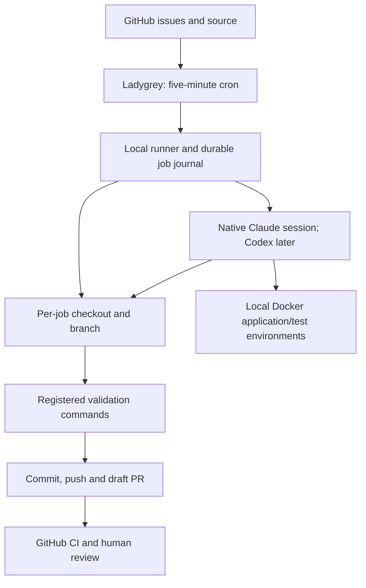

# Ladygrey agent development host

**Status: configuration prepared; live validation pending, updated 2026-09-26.** `ladygrey` is the owner's dedicated
**Surface Pro 3, Intel Core i5 with 8 GB RAM**. Wipe its existing OS and install
Linux during operator-led provisioning. Exact CPU model, SSD size/free space,
network adapter and reserved IP remain to be recorded. No device has been wiped
or provisioned by this document update.

Agents run **natively on the Linux host**. Docker provides application/test
services; no VM, KVM/libvirt installation or guest resource allocation is planned.
The earlier VM proposal is superseded: that extra boundary was considered for
space-needle because it also runs sensitive workloads. Ladygrey is dedicated to
agent development and an unattended Immich photo frame. Hosted model inference
remains remote; no local GPU/model stack is required. The display and agent runner
operate independently, without routine physical interaction.

Fjord stays **Snoot/Houstn monitoring-only pending a new purpose**. It has no queue,
checkout, credential or dispatch role. Space-needle remains critical infrastructure
and does not execute agent jobs. Calavera and Woodstock retain their roles.

## Distribution and hardware setup

Recommend **Debian 13 (trixie), amd64**, with the stock Debian kernel, SSH server
and standard system utilities, then explicitly add Xorg, i3, LightDM, Firefox ESR
and a cursor-hiding utility for the photo display. No full desktop environment is
needed. Use the current stable netinst
image and verify its checksum from [Debian's installer page](https://www.debian.org/releases/stable/debian-installer/).
This matches the fleet's Debian-oriented setup and leaves more RAM for development.

Start without linux-surface. It is a kernel/driver project, not a separate distro.
Its [feature matrix](https://github.com/linux-surface/linux-surface/wiki/Supported-Devices-and-Features)
shows Surface Pro 3 keyboard, touchpad, touchscreen and Wi-Fi support without the
custom-kernel requirement applied to some newer Surfaces. The
[device page](https://github.com/linux-surface/linux-surface/wiki/Surface-Pro-3)
notes touchscreen support in upstream Linux since 4.8 and possible Marvell
firmware needs. Test this unit with the stock kernel before considering extra
repositories or kernel packages. Resolve missing firmware separately from a
kernel replacement; Debian's installer supports
[loading/installing firmware](https://www.debian.org/releases/stable/amd64/ch06s04).
Cameras, pen and touch interaction are not prerequisites for either role.

Provisioning sequence:

1. Confirm the Surface's identity and SSD, retain anything the operator needs,
   then use the Debian installer to erase/install on that device. No guessed
   block-device wipe commands. Use hostname `ladygrey`; reserve its actual IP.
2. Verify boot, storage, Type Cover/console, network, charging and thermal behavior.
   Prefer a tested USB Ethernet adapter/dock for always-on use; confirm it exists
   before planning around it. Test Wi-Fi if it will be the permanent interface.
3. Apply available firmware/OS updates and validate Secure Boot with the chosen
   installer/kernel. Add custom Surface components only for a reproduced problem.
4. Configure `adminhabl` for operator SSH, test the new key in a second session,
   then disable password authentication. Keep local console recovery available.
5. Configure power policy so AC-powered idle/Type Cover closure does not suspend
   jobs. Keep low-battery protection; verify reboot recovery and behavior after
   a power interruption. Check battery condition and ventilation.
6. Add a `hosts/ladygrey/host.conf` and host-specific bootstrap during implementation,
   with Snoot and Houstn/Glances monitoring plus the local photo kiosk. Do not
   inherit hub, public proxy, tunnel or production roles. Add the actual address to monitoring/DNS
   after it is allocated, not by guessing a fleet address.

## Unattended photo display

Use **LightDM auto-login → i3/X11 → Firefox ESR in kiosk mode** under a separate
unprivileged display account. Reuse the generic fullscreen, hidden-cursor and
browser-relaunch patterns from Calavera/Woodstock. Do not copy their complete
bootstrap: Surface Pro 2 Wi-Fi fixes and music-driven display power behavior are
not Ladygrey requirements. Niri is unnecessary for this single-window display.

The proposed slideshow application is the community project
[Immich Kiosk](https://docs.immichkiosk.app/), served locally by a small container
bound to loopback, with a pinned release. It supports album-based browser
slideshows; its current documentation requires Immich 3.2.0+ and Firefox 107+.
Confirm the existing Immich version before choosing the release. Record the
Immich endpoint and desired album during onboarding; neither is in this repo.

Keep the Immich API key in the kiosk service's private
[secret file](https://docs.immichkiosk.app/configuration/core/), outside Git and
agent checkouts. Use only the permissions required by the selected release,
ideally with a dedicated Immich account that can read the chosen shared album.
Verify that account's access; a slideshow album filter does not restrict what
the credential can read. The browser opens the local kiosk URL, without an
Immich administrator login. The display account has no agent credentials, sudo
or Docker access; agent jobs do not inherit its graphical session environment.
The local photo endpoint is not a strong privacy boundary against host code.

Start with still photos, slow transitions and no audio/video. Hide desktop bars
and the cursor; restore fullscreen automatically after reboot or browser failure.
Test recovery after Immich/network outages and configure a local fallback image
if needed. Disable idle screen blanking during display hours. An optional night
schedule may turn off the panel, while the host and agent jobs keep running.

Run the kiosk independently of per-job Docker stacks and cleanup. Restarting
the browser must not interrupt jobs; ending a job must not stop the slideshow.

## Execution architecture



Start with **one active job across both repositories**. Claude runs directly on
Debian in a dedicated development account; Codex will use the same model once its
adapter is implemented. Use separate per-job clones so manual/reference checkouts
are not reset. Record base SHA, issue snapshot, prompt version, CLI version and
validation results. Run project toolchains locally or in Docker as each project
requires; no VM image or artifact-import pipeline is needed.

Use an unprivileged agent account with no general sudo access. Keep operator
configuration and firewall management under an administrative identity. Choose
Docker access during onboarding: prefer rootless Docker for agent-managed
application stacks when the apps support it, or let the trusted runner manage
rootful Docker. Do not silently add the agent account to the rootful Docker group:
that grants host administration capability. Host-native execution is deliberately
not a disposable security sandbox; the machine is dedicated and carries no
production secrets, NAS mounts or access keys for other fleet hosts.

Provider auth is stored on Ladygrey under the execution account with restrictive
permissions. Start with the existing Claude subscription login or explicitly
choose separately billed API access. A normal persisted CLI login is suitable
for initial native sessions; the standard prompt is still to be refined. Use a
repository-scoped GitHub identity for fetching, labels and draft PR publication.
If publisher and agent share an account, credentials are accessible to that
account's code; separate identities if credential isolation is required.

## Network policy: internal development host

Ladygrey has **no public ingress**: no Cloudflare connector, WAN port forward,
public origin or broad VPN/subnet-router role. It is not Viking's production DMZ
role. It needs Internet access and explicitly limited LAN access.

The concrete addresses and firewall rules will be designed after identifying
its interface, management clients, DNS/NTP providers, Docker mode and router
capabilities. Proposed policy:

| Traffic | Intended policy |
|---|---|
| Ladygrey → public Internet | Allow model APIs, GitHub, package/image registries and OS updates, initially public TCP 443; add specific exceptions when needed |
| Ladygrey → chosen DNS/NTP | Allow only the configured resolver/time-service addresses and ports |
| Approved admin device(s) → Ladygrey | Allow SSH; no general LAN-wide management access |
| Space-needle monitoring → Ladygrey | Allow only required Snoot/Glances ports (45876/61208), with source restriction |
| Photo kiosk → Immich | Allow the identified server address and service port only; restrict to the kiosk's egress identity/path where practical |
| Ladygrey → other LAN services | Deny new connections by default; approve individual dev dependencies if needed |
| Ladygrey → production/NAS/router management | Deny, except explicitly approved DNS/NTP and the Immich photo endpoint |
| Local agent → its job services | Allow required loopback/per-job application access |
| Other inbound traffic | Deny unless a specific development preview is deliberately exposed to selected clients |

Allow established replies to permitted connections. Include actual LAN, VPN and
IPv6 prefixes, not only RFC1918. A permitted DNS server must not also become an
exception for its SSH/web/storage ports. Use loopback-bound application ports
for local use; view previews via SSH forwarding initially. Do not copy project
Compose defaults that publish ports to every interface without reviewing them.
The photo role needs API access, not a NAS/photo-library mount. If Immich shares
a reverse-proxy address and port with other applications, an IP/port allowance
also reaches those applications; retain application authentication and use a
more selective proxy policy if that exception must be limited by hostname.

Start with a root-managed host firewall covering native process egress and the
actual container packet paths. Docker published ports/forwarding need separate
attention; host INPUT rules alone are insufficient. See
[Docker firewall behavior](https://docs.docker.com/engine/network/packet-filtering-firewalls/).
For rootless networking, identify and test the host-side egress path as well.
Keep firewall rules out of the development account's control.

For enforcement that survives host compromise, use router/switch-enforced
segmentation (an internal development VLAN/SSID) if the existing network supports
it. This need not be a public-facing DMZ. On a flat LAN, host firewall restrictions
are a useful baseline but are weaker if an agent gains root; a router cannot
filter same-subnet traffic that bypasses it. Record the chosen strength and
limitations rather than claiming isolation from the absence of inbound Internet
access. Test the rules from both the host and representative application containers.

## Projects, storage and capacity

Register `hsimah/clog` and `hsimah-services/toroid`, initially Claude-only.
Verify each app's current PHP/Composer, Node/package manager, generator and test
requirements on x86-64. Start Clog's environment first, then Toroid's. Run only the
needed WordPress/database/Redis or frontend services, using synthetic data and
per-job names/networks/volumes. Do not start both complete stacks by default.

Proposed locations:

```text
/etc/loft/dev-runner/                operator-managed runner configuration
/srv/agent-dev/projects/<project>/  persistent manual/reference checkouts
/srv/agent-dev/jobs/<job-id>/        independent clones, logs and job records
```

Set ownership for the chosen development/runner identities. Keep provider login
state in the execution account's private CLI configuration. Determine SSD quotas
after inspection. Retain job reports/failed work for a proposed seven days and
prune only expired resources recorded for the job. Back up runner state and
configuration, encrypt credential backups and never run blanket Docker pruning.

All 8 GB is shared by the host OS, monitoring, photo browser/kiosk, agents and
applications. Measure kiosk idle usage and a representative job's peak memory
and CPU/thermal behavior while the slideshow is running. Reserve display and
OS/monitoring headroom and limit background services. Heavy checks can go
to GitHub CI. Swap can absorb spikes but is not the capacity plan. No GPU purchase
or local inference service is planned.

## Queue and recovery behavior

- Poll every five minutes on Ladygrey only. A lock covers each complete job and a
  durable record prevents repeated polls from running the same issue again.
- Require an open issue in an allowlisted repository, a trusted author, `agent:ready`
  and exactly one provider label. Initially only `agent:claude` is implemented;
  `agent:codex` is a future adapter. Exclude PRs and running/review/blocked/cancel
  issues. Verify trusted label-setter policy before expanding collaborator access.
- Re-read eligibility before claiming. Run a standard prompt plus the issue
  snapshot through stdin/structured arguments, never shell interpolation.
  Missing credentials, prompt or required checks prevents execution.
- Supervise the native process and its child commands with a proposed one-hour
  wall-clock limit. Require structured completion and independently successful
  registered checks before committing and opening a draft PR. Distinguish CI-only
  checks from local checks. No auto-merge, deployment or force-push.
- Preserve logs and partial changes on failure. Recover the specific process/job
  environment after reboot; require explicit execution retries. Reconcile an
  existing branch/PR before retrying publication so network failures do not create
  duplicate PRs or repeat model work.
- Cancellation must terminate the job's process group and owned services and
  prevent publication. Disabling cron only stops intake. Retention must preserve
  the journal entries needed for duplicate prevention.

## Implementation sequence

1. Wipe/install Debian as `ladygrey`, verify stock-kernel hardware support and
   record the reserved address. No linux-surface packages unless required.
2. Add fleet identity, key-only SSH, monitoring and AC power behavior. Configure
   the separate display account and i3 kiosk; record Immich version, endpoint,
   album and credentials. Verify unattended startup and recovery.
3. Set and test internal network permissions for native processes and Docker;
   include the specific Immich exception and keep public ingress disabled.
4. Move old Fjord runner examples to shared assets or `hosts/ladygrey/dev-runner/`.
   Replace legacy `fjord-dev` paths/image/container names. Adapt the Claude adapter
   to native execution, user-scoped authentication and process-group cancellation.
5. Prepare Clog/Toroid checkouts, toolchains and per-job Docker definitions. Set
   required checks, prompt and observed resource limits.
6. Complete one small manual issue-to-draft-PR run. Test duplicate polling,
   incomplete results, failed checks, cancellation, reboot and publication recovery.
   Verify slideshow responsiveness during builds, independent service restarts,
   display scheduling and recovery from an Immich outage.
7. Enable a single cron entry only after those checks. Add Codex and automated
   retention as follow-up work.

The [provisioning runbook](../docs/operations/ladygrey-setup.md) now documents
the prepared Ladygrey manifest, bootstrap, kiosk, monitoring integration and native
adapter. Credentials, network validation, project commands and live acceptance
remain onboarding requirements.

The [earlier prototype guide](../docs/operations/fjord-dev-runner.md) documents the
existing Docker-wrapped Claude implementation, which remains unenabled. The runner now also supports native execution selected
by Ladygrey’s configuration; the legacy guide describes its Docker mode.
No VM work is required. Fjord's monitoring-only manifest is unchanged.
